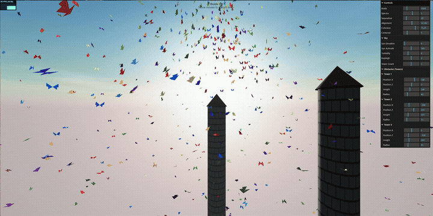
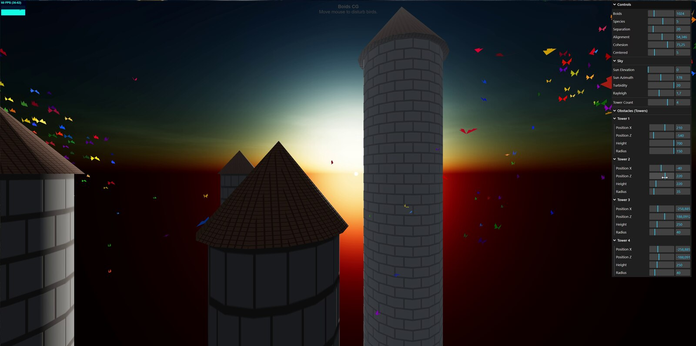
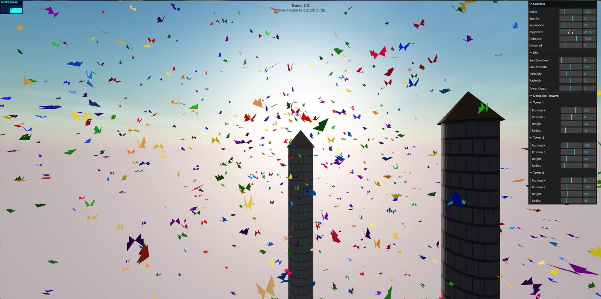
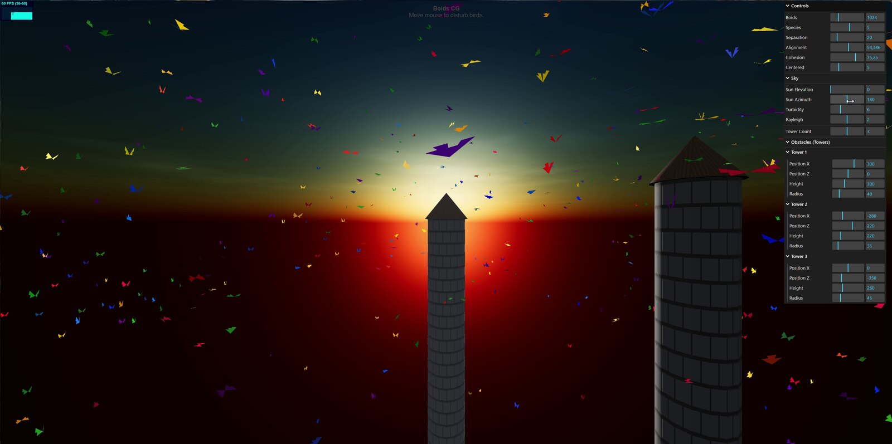
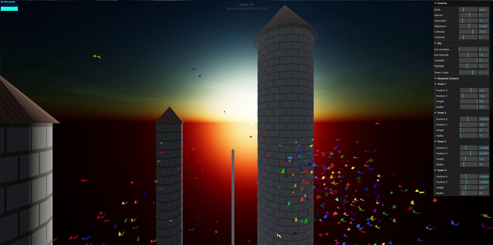

# Boids CG — GPGPU Flocking Simulation

A real-time flocking (boids) simulation built with **Three.js** and **GPGPU GLSL shaders**, where thousands of butterfly-shaped agents flock, avoid obstacles, and fly under a procedural sky — entirely computed on the GPU.



## Features

- **GPU-accelerated flocking** — separation, alignment, and cohesion computed per-frame directly on the GPU via `GPUComputationRenderer`, supporting thousands of agents in real time
- **Multi-species behavior** — up to 8 species, each with its own color and species-aware cohesion/separation rules
- **Butterfly-shaped boids** — custom geometry with a hinge-based wing-fold animation, per-boid color jitter (HSL) and size variation
- **Procedural sky** — physically based atmospheric scattering (Preetham model), with adjustable sun position, turbidity, and Rayleigh scattering
- **Obstacles** — 1 to 5 procedural towers with capsule-based collision avoidance, canvas-generated brick and shingle textures used as color and bump maps
- **Predator / mouse interaction** — move the mouse to scare the flock away
- **Live tuning via GUI** — every parameter (flock behavior, sky, towers) is exposed through an on-screen control panel

## Preview

| Sky & towers | Wide flock view |
|---|---|
|  |  |

| Tower detail | Boid close-up |
|---|---|
|  |  |

## Getting Started

### Prerequisites

- [Node.js](https://nodejs.org/) (LTS recommended)
- npm (bundled with Node.js)

### Installation

```bash
git clone https://github.com/LytTheBit/Boids_CG.git
cd Boids_CG
npm install
```

### Run in development mode

```bash
npm run dev
```

Then open the local URL printed in the terminal (Vite's default dev server).

### Build for production

```bash
npm run build
npm run preview   # optional: preview the production build locally
```

## Controls

- **Mouse movement** — acts as a predator, scaring nearby boids away
- **GUI panel** (top-right) — tune flock behavior (separation, alignment, cohesion, center pull), sky parameters (sun position, turbidity, Rayleigh scattering), and tower placement/count

## Tech Stack

| Library | Purpose |
|---|---|
| [Three.js](https://threejs.org/) | WebGL rendering: scene, camera, materials, lights |
| `GPUComputationRenderer` (Three.js addon) | GPGPU simulation: boid position/velocity state stored and updated in textures |
| GLSL | Custom shaders for simulation (position/velocity) and rendering (vertex/fragment) |
| `Sky` (Three.js addon) | Procedural atmospheric sky (Preetham model) |
| `lil-gui` (Three.js addon) | Interactive control panel |
| `Stats.js` (Three.js addon) | FPS/performance overlay |
| [Vite](https://vitejs.dev/) | Dev server and bundler |

## Project Structure

```
Boids_CG/
├── index.html
├── package.json
└── src/
    ├── index.js              # Scene setup, sky, towers, GUI, render loop
    ├── simulation.js         # BoidsSimulation: GPGPU state management
    ├── BirdGeometry.js       # Butterfly-shaped geometry for all boids
    ├── style.css
    └── shaders/
        ├── fragmentShaderPosition.glsl   # GPGPU: position + wing-flap phase update
        ├── fragmentShaderVelocity.glsl   # GPGPU: flocking rules, obstacle avoidance, predator
        ├── birdVertex.glsl               # Rendering: wing fold, orientation, per-boid scale
        └── birdFragment.glsl             # Rendering: color, depth-based shading
```

## How It Works (Short Version)

Boid positions and velocities aren't computed on the CPU — they live in textures on the GPU, one pixel per boid. Each frame, two GLSL shaders update these textures: `fragmentShaderVelocity.glsl` applies separation, alignment, cohesion, obstacle avoidance, and the predator response; `fragmentShaderPosition.glsl` integrates the new position and updates the wing-flap animation phase. The rendering shaders (`birdVertex.glsl` / `birdFragment.glsl`) then read these textures to place, orient, and color each boid — all without ever transferring data back to the CPU.

## Author

Francesco Bonaiuti — university computer graphics course project.

## License

No license specified yet — add one (e.g. MIT) if you'd like others to freely reuse this code.
